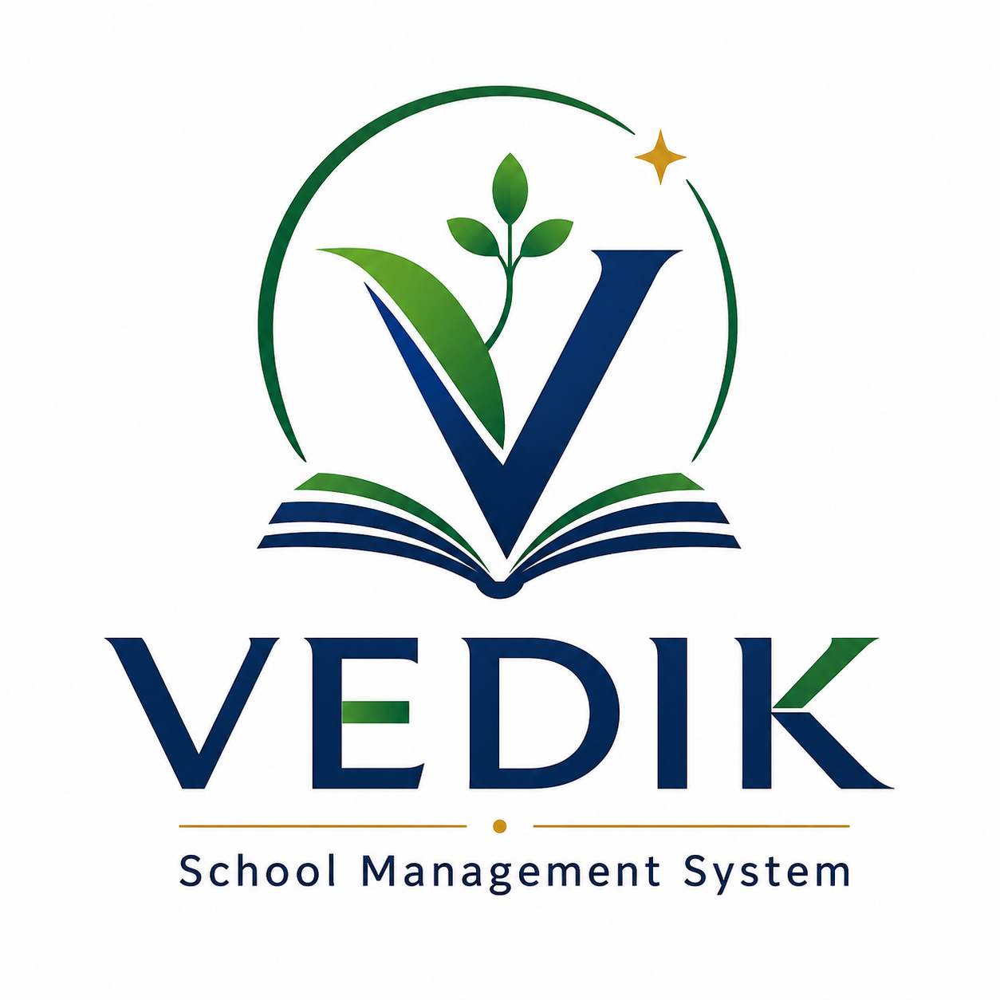

<div align="center">



# VEDIK School Management ERP

**The complete solution for modern school management.**

[Live Demo](#) | [Features](#features) | [Modules](#modules) | [Get Started](#get-started)

</div>

---

## What is VEDIK?

VEDIK School ERP is a powerful, all-in-one management system designed to streamline every aspect of school administration — from student admissions to fee collection, teacher management to academic reporting.

Everything you need to run your school efficiently, in one place.

---

## Features

- **30+ Fully Functional Pages** — Every module built with realistic data and complete workflows
- **Beautiful Glassmorphism Design** — Modern, clean interface that's a pleasure to use
- **Dark & Light Mode** — Switch themes instantly to match your preference
- **Print-Ready Documents** — Fee receipts, payslips, certificates, and ID cards with your school branding
- **Works Everywhere** — Responsive design that looks great on desktop, tablet, and mobile
- **Role-Based Access** — Different views for administrators, teachers, and staff

---

## Modules

### Student & Academics
| Module | What It Does |
|--------|--------------|
| Dashboard | At-a-glance overview with charts, stats, and quick actions |
| Students | Admissions, profiles, promotions, ID cards, and search |
| Teachers | Profiles, subject assignments, and salary management |
| Attendance | Daily tracking, class-wise reports, and export |
| Academics | Classes, sections, subjects, and timetable |
| Exams | Schedule creation and status tracking |
| Marks | Student-wise marks, grade distribution, and analytics |
| Homework | Assignment creation, submission tracking, and grading |

### Finance & Operations
| Module | What It Does |
|--------|--------------|
| Fees | Collection, receipt generation, pending tracking, and overdue alerts |
| Finance | Income, expenses, profit/loss tracking with charts |
| Payroll | Salary slips, allowances, deductions, and print/download |
| Library | Book inventory, availability tracking, and issue/return |
| Transport | Fleet management, route tracking, and capacity |
| Hostel | Room management, occupancy tracking, and warden info |
| Inventory | Stock management, low-stock alerts, and restocking |

### Communication & Reports
| Module | What It Does |
|--------|--------------|
| Communication | Announcements, circulars, and priority messaging |
| Certificates | 9 types: Bonafide, Study, Character, Transfer, and more |
| Reports | Student, attendance, fee, financial, and exam reports with export |
| Staff | Non-teaching staff management |
| Leave | Staff leave requests and approval workflow |
| Settings | School profile, theme customization, and notifications |

---

## Why Schools Love VEDIK

| Benefit | Description |
|---------|-------------|
| **Save Time** | Automate routine tasks like attendance, fee collection, and report generation |
| **Reduce Errors** | Eliminate manual data entry with smart forms and validation |
| **Stay Organized** | Centralized dashboard gives you complete visibility |
| **Look Professional** | Beautiful receipts, certificates, and ID cards with your school branding |
| **Make Better Decisions** | Real-time charts and analytics for data-driven management |
| **Work From Anywhere** | Access your school data from any device |

---

## Pricing Plans

VEDIK offers flexible plans to fit schools of all sizes.

| Plan | Students | What's Included |
|------|----------|-----------------|
| **Trial** | 50 | 8 core modules — free for 14 days |
| **Lite** | 200 | 11 modules |
| **Essential** | 1,000 | 13 modules |
| **Pro** | 5,000 | 18 modules |
| **Enterprise** | Unlimited | All 18 modules |

---

## Getting Started

### Option 1: Quick Launch (Windows)

1. Double-click `START.bat`
2. Open your browser to `http://localhost:3000`
3. That's it — you're ready to explore!

### Option 2: Manual Setup

```bash
git clone https://github.com/your-username/school-erp-demo.git
cd school-erp-demo
npm install
npm run dev
```

Then open `http://localhost:3000` in your browser.

---

## What's Inside

> All data comes pre-loaded with realistic information — 15 students, 8 teachers, 5 classes, 15 subjects, and much more — so you can see exactly how VEDIK works for your school.

---

## Supported Browsers

Chrome | Firefox | Safari | Edge

---

## Contact

Interested in the full VEDIK School ERP system for your institution?

**Reach out to our team** for a personalized demo and pricing details.

---

<div align="center">

**VEDIK School Management ERP** | v2.0 | 2026

*Empowering schools with smart management*

</div>
